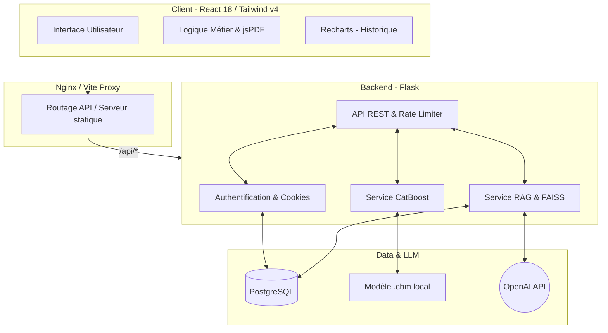

# 📊 ESG Platform - Documentation Technique & Architecturale Complète

**Version:** 2.0.0 (Production-Ready)
**Date:** Mai 2026
**Stack Principale:** React 18 (Vite) + Tailwind CSS v4 | Flask (Python) | CatBoost ML | FAISS (RAG) | PostgreSQL | Docker

---

## 📑 Table des Matières
1. [Vue d'ensemble du Projet](#1-vue-densemble-du-projet)
2. [Architecture Globale](#2-architecture-globale)
3. [Modèle d'Intelligence Artificielle (CatBoost)](#3-modèle-dintelligence-artificielle-catboost)
4. [Moteur RAG & IA Générative](#4-moteur-rag--ia-générative)
5. [Fonctionnalités Clés & Parcours Utilisateur](#5-fonctionnalités-clés--parcours-utilisateur)
6. [Sécurité & Authentification](#6-sécurité--authentification)
7. [Base de Données & Modélisation](#7-base-de-données--modélisation)
8. [Déploiement & Infrastructure Docker](#8-déploiement--infrastructure-docker)
9. [Guide d'Installation (Local)](#9-guide-dinstallation-local)

---

## 1. Vue d'ensemble du Projet

**ESG Platform** est une solution B2B complète permettant aux entreprises, investisseurs et consultants d'évaluer, de prédire et d'améliorer les performances environnementales, sociales et de gouvernance (ESG) d'une organisation.

### Valeur Ajoutée (USP)
- **Prédiction ML Temps Réel:** Évaluation instantanée du score ESG (0-100) basée sur 23 indicateurs financiers et extra-financiers.
- **Rapports Automatisés:** Génération native de rapports PDF via `jsPDF`.
- **Mémoire Pédagogique:** Historique des simulations sauvegardé et visualisable.
- **Assistant IA (RAG):** Chatbot spécialisé ESG répondant à partir d'une base documentaire stricte.

---

## 2. Architecture Globale

L'application repose sur une architecture découplée orientée micro-services (via Docker).



---

## 3. Modèle d'Intelligence Artificielle (CatBoost)

Le cœur de la plateforme est un modèle de Machine Learning entraîné pour prédire le score ESG à partir de données asymétriques et non linéaires.

### 3.1 Technologie Choisie : CatBoost (Yandex)
CatBoost (Categorical Boosting) a été choisi pour sa gestion native exceptionnelle des variables catégorielles (`primary_industry`) et sa robustesse face aux données manquantes, typiques des rapports RSE.

### 3.2 Les 23 Features d'Entrée (Strictement validées par Pydantic)
Pour garantir la fiabilité de la prédiction, les données envoyées au modèle subissent une validation rigoureuse.
* **Catégorielle encodée :** `industry_target_enc` (Target Encoding de l'industrie)
* **Logarithmiques :** `log_market_cap`, `log_employees`, `log_revenue_wins`, `log_scope_1`, `log_scope_2`, `log_scope_3`, `log_energy_consumption`, `log_waste_production`, `log_water_consumption`, `log_hours_of_training_wins`, `log_ceo_compensation`, `log_legal_costs_paid_for_controversies`
* **Intensités (Ratios) :** `intensity_scope_1`, `intensity_scope_2`, `intensity_scope_3`, `intensity_energy`, `intensity_waste`, `intensity_water`, `intensity_training`, `intensity_productivity`
* **Autres :** `independent_board_members_percentage`, `revenue_negative_flag`

### 3.3 Pipeline de Prédiction
1. Le Frontend envoie le JSON via `POST /api/predict` (avec Cookie de session).
2. Pydantic valide les types et les bornes.
3. Le TargetEncoder encode l'industrie choisie.
4. Le modèle CatBoost (`catboost_model.cbm`) génère le score final.
5. Le score est sauvegardé en base de données pour l'historique utilisateur.

---

## 4. Moteur RAG & IA Générative

L'assistance documentaire est fournie par un système de **Retrieval-Augmented Generation (RAG)**.

### 4.1 Fonctionnement
- **Vectorisation:** Les documents ESG (PDFs, textes de lois) sont convertis en embeddings via `SentenceTransformers (all-MiniLM-L6-v2)`.
- **Indexation:** La recherche sémantique est ultra-rapide grâce à **FAISS** (Facebook AI Similarity Search).
- **Génération:** Les paragraphes les plus pertinents (Top K) sont injectés dans le prompt d'**OpenAI (GPT-4/3.5)** pour formuler une réponse sourcée.

### 4.2 Fallback de Sécurité
En cas de défaillance de l'API OpenAI ou d'absence de clé API valide (`.env`), un système de secours (Fallback) renvoie directement les extraits bruts issus de FAISS, garantissant que l'utilisateur reçoit toujours de l'information.

---

## 5. Fonctionnalités Clés & Parcours Utilisateur

### 5.1 Génération de Rapports (jsPDF)
La fonction d'export PDF a été réécrite nativement en **jsPDF** pour remplacer `html2canvas`.
* **Avantages :** Zéro crash lié au CSS moderne (comme les couleurs `oklch` de Tailwind v4), texte sélectionnable, poids du fichier divisé par 10, mise en page stricte en deux colonnes avec en-tête colorée.

### 5.2 Historique des Scores
* **Sauvegarde automatique :** Chaque prédiction est insérée dans la table `PredictionHistory`.
* **Visualisation :** Le graphique `Recharts` au bas de la page de prédiction récupère la route `GET /api/history` et affiche l'évolution de la performance ESG de l'entreprise dans le temps.

---

## 6. Sécurité & Authentification

La plateforme a subi un audit de sécurité complet pour répondre aux normes de déploiement en entreprise :

1. **Cookies HttpOnly, Secure & SameSite=Strict :**
   Les tokens JWT ne sont **plus stockés dans le localStorage** (vulnérables aux attaques XSS). Ils sont déposés dans des cookies inaccessibles par JavaScript.
   *Le frontend utilise `credentials: 'include'` pour chaque requête.*

2. **Rate Limiting (Limitation de requêtes) :**
   Prévention contre les attaques Brute-Force et DDoS via `Flask-Limiter`.
   - `/api/auth/login` : Limité à 5 requêtes par minute.
   - `/api/predict` : Limité à 20 requêtes par minute.

3. **Protection contre la Fuite d'Information :**
   En mode production (`FLASK_ENV=production`), le mode debug de Flask est désactivé, empêchant l'exposition des PIN de débogage.

---

## 7. Base de Données & Modélisation

Le système utilise SQLAlchemy comme ORM. En local, SQLite est utilisé. En production (Docker), c'est une instance **PostgreSQL**.

### 7.1 Table `users`
Stocke les informations d'authentification (Mots de passe hachés via Bcrypt).

### 7.2 Table `prediction_history`
| Colonne | Type | Description |
|---|---|---|
| `id` | Integer | Clé primaire |
| `user_id` | Integer | Clé étrangère vers `users.id` |
| `primary_industry` | String | Secteur de l'entreprise |
| `score` | Float | Score ESG final obtenu |
| `features_data` | JSON | La totalité des 23 inputs saisis par l'utilisateur (Pour le simulateur) |
| `created_at` | DateTime | Horodatage (Timestamp) |

---

## 8. Déploiement & Infrastructure Docker

La plateforme est "Production-Ready" et conteneurisée. Le déploiement s'effectue via `docker-compose.yml`.

### 8.1 Services Docker
- **`db`** : Conteneur PostgreSQL officiel.
- **`backend`** : Conteneur Flask servant les API ML et d'Auth. Gunicorn recommandé pour le run.
- **`frontend`** : Build statique React/Vite servi par un serveur **Nginx** (faisant aussi office de Reverse Proxy vers le Backend).

### 8.2 Configuration (`.env.docker`)
Toutes les variables sensibles et de configuration sont centralisées.
* Les origines CORS sont strictes.
* Les clés secrètes `SECRET_KEY` et `JWT_SECRET_KEY` sont injectées.
* L'URL de la base de données pointe vers le réseau interne Docker (`postgresql://esg_user:esg_password@db:5432/esg_db`).

---

## 9. Guide d'Installation (Local)

Pour reprendre le développement ou tester l'application en local :

```bash
# 1. Cloner le dépôt et installer les dépendances Node
npm install

# 2. Configurer l'environnement Python
python -m venv .venv
# Sur Windows :
.\.venv\Scripts\activate
# Installer les dépendances backend
pip install -r backend/requirements.txt

# 3. Lancer la plateforme (Script tout-en-un)
npm run dev:full
```

Le script `dev:full` (via `concurrently`) démarre :
1. Le Frontend Vite (`http://localhost:5173`)
2. Le Backend Flask (`http://localhost:5050`)
3. La base de données locale se synchronise automatiquement.

---
*Ce document reflète l'état final de la plateforme, incluant toutes les optimisations d'interface (Tailwind v4), de sécurité (Cookies, Rate Limiting), de performance ML (CatBoost 23 features) et de fiabilité architecturale.*
